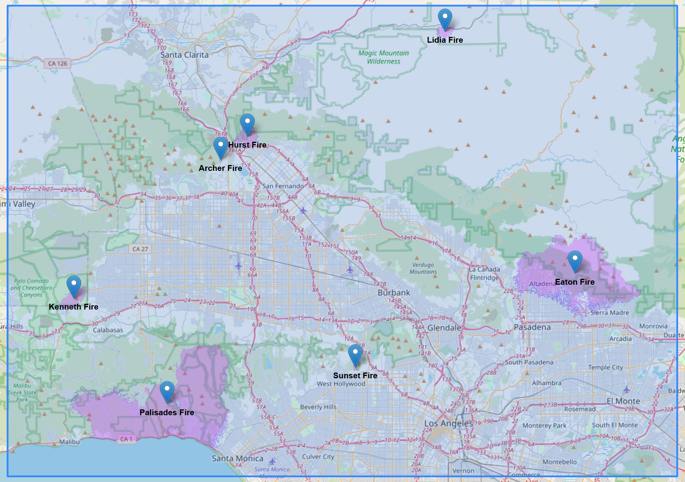

# January 2025 Southern California Wildfires Burn Severity Sentinel2

## Overview

This repository contains scripts and data for analyzing burn severity of the January 2025 wildfires in Southern California using Sentinel-2 satellite imagery. The analysis utilizes the difference *Normalized Burn Ratio* (**dNBR**) and *Relativized Burn Ratio* (**RBR**) to classify areas based on burn severity.

## Data

This repository provides essential datasets for analyzing burn severity in the Southern California wildfires of January 2025. The data components are organized as follows:

- **Burn Severity Map**: The output image generated by running the JavaScript script in the **Copernicus EO Browser**. This map classifies burn severity across the region of interest based on pre- and post-fire Sentinel-2 imagery. It includes varying levels of burn severity, from unburnt to high severity, and is stored in the `/assets/` directory. The burn severity classification is derived using the Normalized Burn Ratio (NBR) and Relativized Burn Ratio (RBR).

- **Wildfire Event Names**: A list of wildfire events analyzed in this study, each corresponding to a specific fire event within the Southern California region during the January 2025 fire season. This dataset, provided in the `data/wildfire_area_names.json` file, includes the names of the fires and is used for the subsequent generation of the interactive map in HTML. These names are referenced to label specific areas on the map, allowing users to explore the burn severity by wildfire event.

- **Geospatial Region Bounding Box**: A geographic boundary that defines the area of study for the burn severity analysis, corresponding to the spatial extent of the Sentinel-2 imagery used. This bounding box is represented in the `data/region_bounding_box.json` file in GeoJSON format and ensures that the output burn severity maps respect the same spatial resolution and coverage. The coordinates within this bounding box align with the imagery tiles and frame the region affected by the wildfires.

These datasets serve as foundational inputs for the analysis. They are derived from publicly accessible Sentinel-2 satellite data and ensure reproducibility of the burn severity classification process. They also provide necessary context for the results.

The data sources include:
- **Sentinel-2 Satellite Imagery**: Imagery from the Copernicus Sentinel-2 mission, accessed via the [Copernicus Data Space Ecosystem](https://dataspace.copernicus.eu/).
- **Geospatial Coordinates**: The region-specific bounding box data sourced from geospatial metadata and the analysis of fire-affected areas.

These datasets and results facilitate reproducible analysis and can support further research into wildfire impact assessment, remote sensing methodologies, and environmental monitoring.

## Methodology

### Burn Severity Classification

The analysis compares pre-fire and post-fire Sentinel-2 imagery to calculate burn severity.
- **Input Bands**: *Near-Infrared* (**B08**) and *Short-Wave Infrared* (**B12**) from Sentinel-2.
- **Masking**: Irrelevant pixels (e.g., water, clouds) are excluded using the Sentinel-2 Scene Classification Layer (**SCL**).
- **Classification**: Burn severity is categorized based on RBR values:
  - **Unburnt**
  - **Low severity**
  - **Moderate severity**
  - **Moderate-high severity**
  - **High severity**

## Interactive Map

This repository includes an interactive **HTML burn severity map**. The map overlays results onto OpenStreetMap, allowing to explore burn severity interactively.

### How to Use

1. Clone or download this repository to your local machine.
2. Open the file `index.html` in your web browser.
3. The burn severity map will be displayed on top of an **OpenStreetMap layer**.
4. You can **zoom**, **pan**, and **click on areas** to view data about the burn severity at different points.

## Data Generation and Processing Guide

The script and data provided in this repository enable the independent generation and processing of burn severity analysis using the **Copernicus EO Browser**.

### Steps

1. **Access the Copernicus EO Browser**:
   - Open the [Copernicus EO Browser](https://browser.dataspace.copernicus.eu/).

2. **Set the Area of Interest**:
   - Use the **Bounding Box** feature to narrow the search to Southern California. The required coordinates are provided in the file [region_bounding_box.json](data/region_bounding_box.json).
   - Alternatively, manually select the area of interest on the interactive map.

3. **Select Time Range**:
   - Click the **Time Range** icon to define the desired date range (pre-fire and post-fire imagery).

4. **Load the Custom Script**:
   - Under the **Layers** tab, select **Custom**, then click **Custom script**.
   - Choose one of the following methods to load the script:
     - **Option 1**: Copy the script from [scripts](scripts) folder and paste it directly into the scripting interface.
     - **Option 2**: Use the **Load script from URL** feature and paste the URL pointing to the script.

5. **Run the Script**:
   - Execute the script to process the Sentinel-2 imagery.
   - The result will be a semi-transparent burn severity map with varying levels of burn severity visualized in gradients of black.

6. **View and Download the Result**:
   - You can view the generated burn severity map directly in the Copernicus EO Browser.
   - If needed, download the processed output image (a Copernicus account is required).
   - For reference, similar processed images are stored in the **`/assets/`** folder of this repository.

## License

- Scripts are licensed under the [MIT License](LICENSE-SCRIPTS).
- Images and analysis content are licensed under the [Creative Commons Attribution 4.0 International License](LICENSE).
